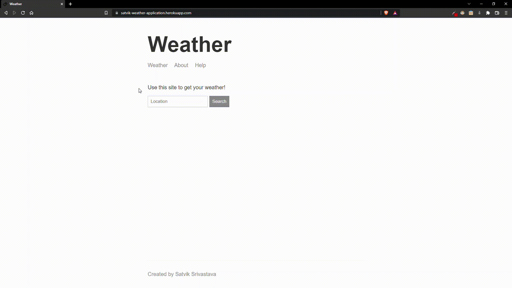
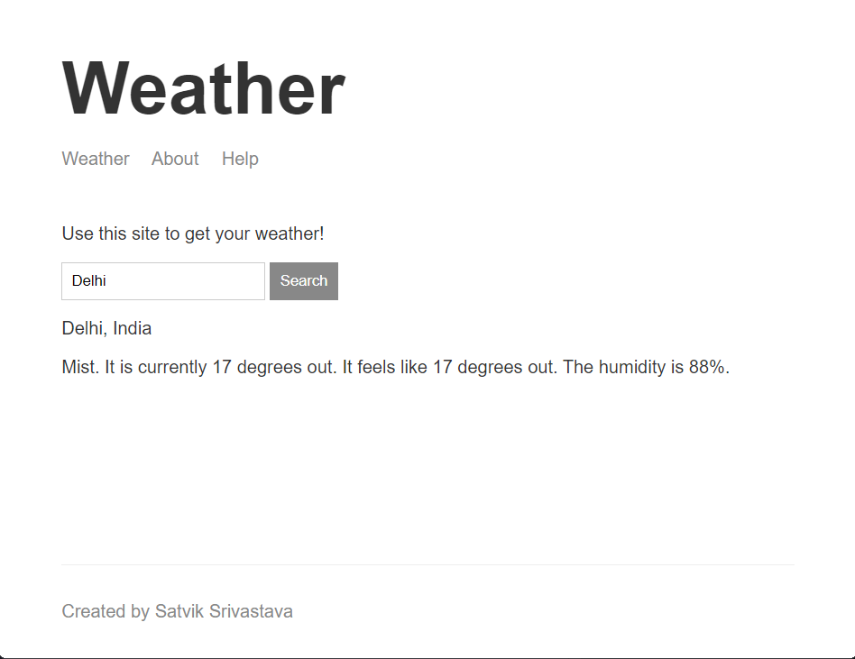
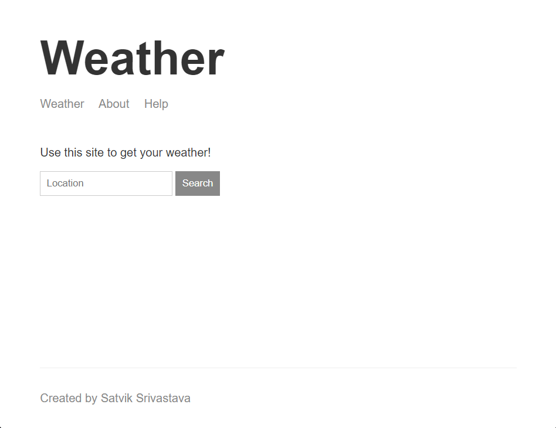
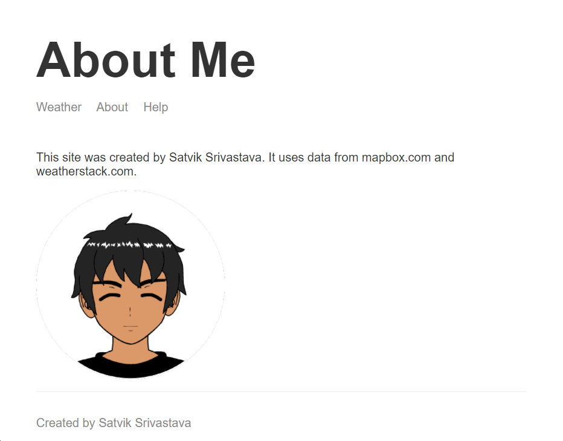
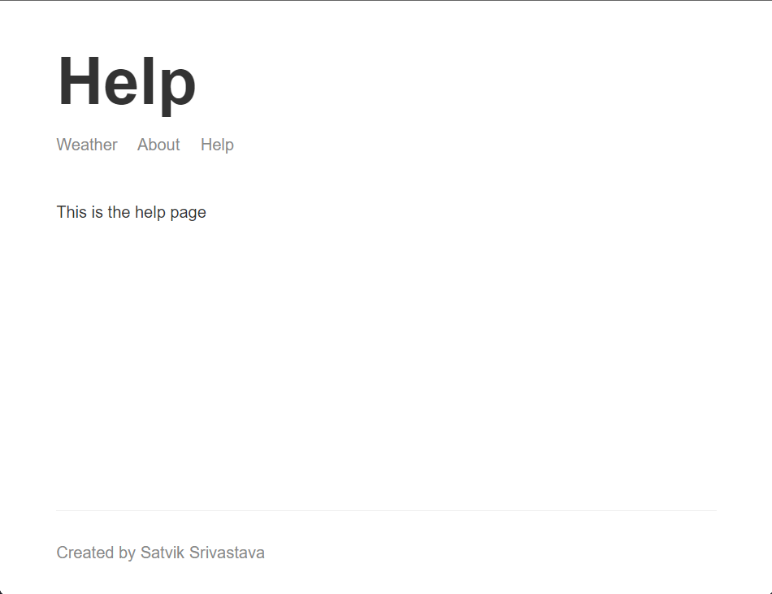

#  Weather Website

## Table of Contents

- [Demo](#demo)
- [Description](#description)
- [Features](#features)
- [Concepts Used](#concepts-used)
- [Screenshots](#screenshots)
- [Run Locally](#run-locally)
- [Tech Stack](#tech-stack)
- [Author](#author)

## Demo

[Weather Website](https://satvik-weather-application.herokuapp.com/)



## Description

This is a weather website which shows the weather condition (obviously :/ ) of the location which user enters.

It uses two API endpoints to fetch the weather data.

- [Geocoding](https://www.mapbox.com/): To get the latitude and longitude of the location entered by the user.
- [Weather](https://weatherstack.com/): To get the weather condition of the location entered by the user bu utilizing the latitude and longitude provided by the Geocoding API.

## Features

This has basically one feature, i.e. user can enter the location and get the weather condition of the location.

## Concepts Used

- Asynchronous Node.JS
- Callbacks
- Making HTTP requests
- Building dynamic web pages
- Server side programming through Express.JS
- Parsing JSON data

## Screenshots

_I have mainly focused on the backend programming in this project so the frontend part is not that much fascinating and beautiful._


**Working** : Working state of the website.


**Home Page** : Home page of the website.


**About Page** : About page of the website.


**Help Page** : Help page of the website.

## Run Locally

Clone the project

```bash
  git clone https://github.com/satviksriv/weather-website.git
```

Go to the project directory

```bash
  cd weather-website
```

Install dependencies

```bash
  npm install
```

Start the server

```bash
  npm run start
```

## Tech Stack


## Author

- [@satviksriv](https://github.com/satviksriv)
